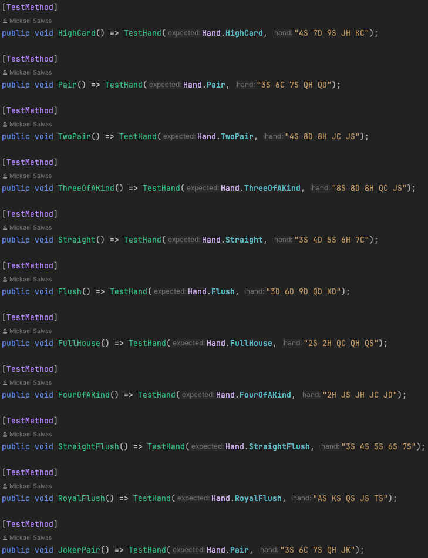

# Projet Poker Hand Analyser
## Concept
Il fallait faire un système analysant une main de Poker indiquée en tableau de String, en plus de faire la gestion de cartes Joker. 

## Exemple

## Technologies
- .net / C#
- Patron de conception Chaine de Responsabilité
- MSTest
